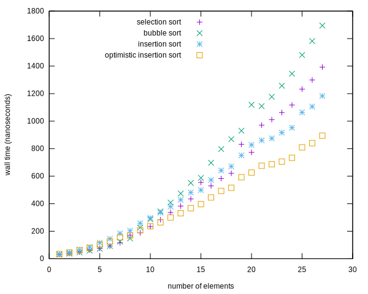
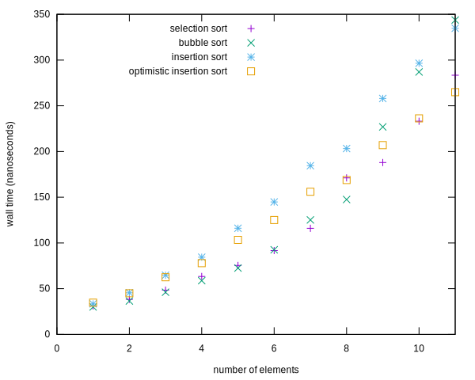

Which Terrible Sort is Fastest?
===============================

If you're sorting fewer than about ten `int`s, bubble sort is fastest.
Otherwise it's terrible.  Here's that graph zoomed in for lower values.

On the other hand, for so few elements you can calculate a [proven optimal][1]
sorting algorithm.  It will [probably][2] still be slower than bubble sort.

[1]: https://en.wikipedia.org/wiki/Sorting_network
[2]: https://www.youtube.com/watch?v=FJJTYQYB1JQ
